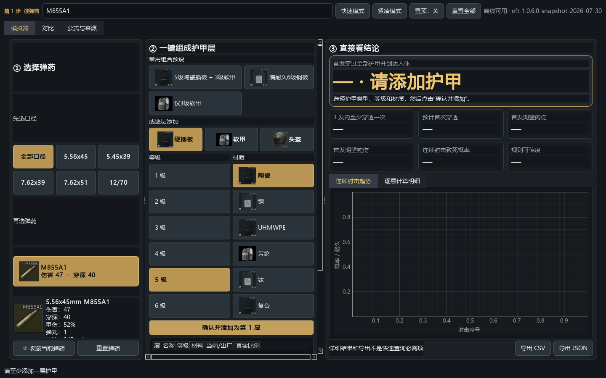

# Escape from Tarkov 分层护甲与弹药模拟器

一个面向游戏中快速查询的非官方 Windows 桌面工具。它离线搜索弹药，把弹丸依次送入任意数量
的护甲层，并显示每层条件穿透率、累计穿透率、停止概率、耐久损失、钝伤和连续射击结果。

> 当前数据快照：`eft-1.0.6.0-snapshot-2026-07-30`  
> 默认规则：`community-approx-2026.07-v1`（**社区近似，不是官方精确公式**）

## 界面

启动后的三栏界面依次是弹药即时搜索、护甲命中路径和核心结果。结果区包含醒目的首发穿透率、
文字风险等级、每层明细以及穿透率/耐久曲线。



## 已支持

- 中文/英文名、简称、别名和口径即时搜索；收藏与最近使用写入 SQLite
- 大按钮选择口径和弹药，并显示弹药、护甲板、软甲和头盔缩略图
- 护甲类型、等级和材质两列选择；每次确认追加一层
- 分别重置弹药、护甲层或全部参数
- 护甲预设；任意层添加/删除；出厂、维修上限和当前耐久严格区分
- 快速解析；NumPy 批量蒙特卡洛；固定种子；后台线程、进度和取消旧任务
- 连续 1–100 发、每发穿透率、首次穿透分布、耐久时间线、胸部致死概率
- 分层条件/累计概率、停止概率、穿透后状态、钝伤与自然语言摘要
- 快速/实验室/紧凑/普通置顶模式；三栏缩放；键盘快捷键
- 弹药对比表和 CSV/JSON 导出
- 离线启动、设置持久化、日志、pytest、ruff 和 PyInstaller 配置

## 快速启动

要求 Python 3.12 或更新版本。

```powershell
python -m venv .venv
.\.venv\Scripts\Activate.ps1
python -m pip install -e ".[dev]"
python -m tarkov_armor_sim
```

应用首次启动会在 `%LOCALAPPDATA%\TarkovArmorSimulator\current.sqlite3` 创建离线数据库。断网不影响
搜索、护甲加载和模拟。日志位于用户目录 `.tarkov-armor-simulator\logs`。

## 数据更新

1.1.0 使用代码内附带、启动时写入 SQLite 的最小审计快照，不会在启动时强制联网。更新快照时应：

1. 从 tarkov.dev API 读取当前字段；
2. 与官方补丁及 Tarkov Changes 交叉检查；
3. 更新 `DATA_VERSION` 和 `docs/RESEARCH.md`；
4. 运行完整回归测试后发布。

当前没有把网络同步按钮伪装为已完成；后续同步失败时也必须保留最后一份有效快照。

## 公式可信度

游戏没有公开完整的当前穿透链路公式。默认规则将护甲等级、相对**出厂**耐久与弹药穿深映射到
单调 Logistic 近似；耐久损伤、穿透后伤害/穿深衰减、钝伤及距离衰减也属于近似。UI 永久显示
数据版本、规则版本和可信度，结果只显示有意义的精度。详细来源见
[调研记录](docs/RESEARCH.md) 与 [公式限制](docs/FORMULA_LIMITATIONS.md)。

碎裂、跳弹、技能、三维碰撞和全身黑部位传播仅保留模型接口，v0.1 默认禁用，避免输出未经验证
的结论。附带离线数据是演示所需的常用子集，并非全量当前物品库。

## 快捷键

| 快捷键 | 操作 |
|---|---|
| `Ctrl+K` / `Ctrl+1` | 聚焦弹药搜索 |
| `Ctrl+2` | 聚焦护甲 |
| `Ctrl+3` | 聚焦结果 |
| `Ctrl+D` | 收藏当前弹药 |
| `Ctrl+S` | 保存当前路径预设 |
| `Ctrl+M` | 快速/实验室模式 |
| `Ctrl+Shift+M` | 紧凑模式 |
| `Ctrl+T` | 普通窗口置顶 |
| `Esc` | 清空搜索 |

## 开发与测试

```powershell
ruff check .
pytest
python -m tarkov_armor_sim
```

核心层无 Qt 依赖；UI 不包含业务公式；网络也不进入模拟器。项目结构：

```text
src/tarkov_armor_sim/
  models.py       数据模型和验证
  rulesets.py     可替换规则接口与元数据
  engine.py       解析和向量化蒙特卡洛
  data.py         SQLite、搜索、收藏、预设与离线快照
  services.py     摘要和导出
  worker.py       Qt 后台任务
  ui.py           PySide6 三栏界面
tests/            单元、服务与 UI 测试
docs/             调研、架构、限制和用户指南
tools/            Windows 构建脚本
```

## Windows 云端构建

正式发布包由 `.github/workflows/windows-release.yml` 在 GitHub Actions 的
`windows-latest` 环境中构建。推送 `v*` 标签后，工作流会运行 lint、完整测试、PyInstaller
构建，生成 `EFT-Calculator-Windows-x64.zip` 并上传到 GitHub Release。用户数据库与设置写到
用户目录，不写入安装目录，目标电脑无需安装 Python。

## 免责声明

本项目是非官方社区工具，与 Battlestate Games 无关联。游戏数据和机制可能随更新改变；结果取决
于标明版本的数据以及公开资料推导，不能视为官方结论。本软件不读取游戏内存、不修改或注入游戏
进程、不创建 DirectX Hook、不自动控制游戏，也不绕过反作弊。Escape from Tarkov 及相关名称和
资产归其权利人所有。

物品缩略图来源和逐文件记录见 [视觉素材来源](docs/ASSET_SOURCES.md)。这些游戏参考图片不属于
本项目 MIT 授权范围；原创应用图标不包含游戏 Logo、角色或原画。
